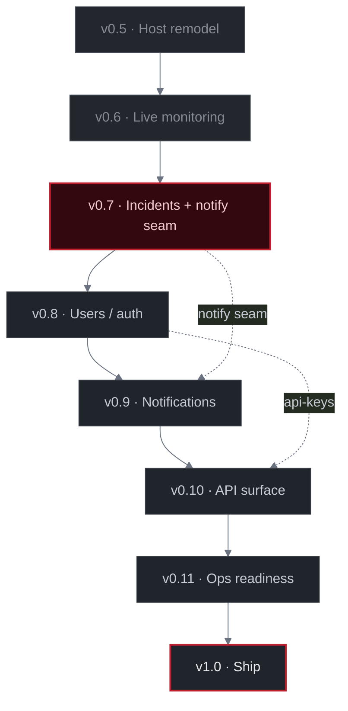

# Roadmap

`watchlight` is evolving in small, shippable phases. Each phase corresponds
to a GitHub milestone; concrete work lives in issues attached to that
milestone. This file is the long-term compass — it rarely changes.

## Guiding principles

- **Feature-package layout.** Domain entity, Service, Repository contract,
  and DTOs all live in `internal/monitor/`. Storage and HTTP are plugins.
- **Service owns business logic, not storage.** Defaults, ID generation,
  validation, and orchestration live in `Service`. Storage just persists.
- **Small, reviewable changes.** Each issue maps to ~one PR. Phases are not
  merged atomically — they close when their issues close.
- **Tests at the boundaries that change.** Service suite first, then storage
  parity against a throwaway SQLite file.
- **No premature optimization.** Correctness and clarity beat cleverness
  until there's a measurable reason to reach for it.

## Architecture decisions already made

These are settled; changing them requires a rethink.

- IDs are `uuid.UUID` (UUIDv7, time-ordered). Generated in `Service`,
  not by the database.
- Repository interface lives with the feature package; storage packages
  import the feature and satisfy the interface structurally.
- `Create` and `Update` are separate methods (no `Save`/upsert). `Update`
  uses pointer-based partial-input semantics.
- Routing: `chi` v5. Config: `cleanenv` (YAML + env overrides).
- Logging: `slog` with a custom pretty handler in dev, JSON in prod.
- SQLite driver: `modernc.org/sqlite` (pure Go, no cgo).
- **Storage is SQLite-only.** The in-memory backend was removed in #35, so
  there is a single persistence layer and no `storage.type` switch.
- Raw check facts cross the scheduler→domain seam as a `CheckResultInput`
  DTO; the domain derives status and mints the result ID.
- **One API surface.** The UI and external automations are both consumers of
  the same HTTP API; they differ only in authentication (session for the UI,
  API key for machines). No separate backend-for-frontend.

## Phases

### v0.1 — Monitor CRUD [done]

Close the CRUD loop and put the Service layer under tests so subsequent
phases can refactor safely.

- `PATCH /monitors/{id}` handler + partial-update DTO
- `DELETE /monitors/{id}` handler, router wiring
- Service test suite covering Create, Get, Update, List, Delete, and known
  error paths
- CI: GitHub Actions running `go build`, `go vet`, `go test` on push and PR

**Exit criteria:** all five endpoints respond correctly (including 404/409
for known error cases), tests are green, CI is green on `main`.

### v0.2 — SQLite storage [done]

Persist monitors and check results in SQLite as the single storage backend,
wired into `cmd/server`.

- Full read/write/delete surface on `sqlite.Storage` (`CreateMonitor`,
  `GetMonitor`, `GetMonitorList`, `UpdateMonitor`, `DeleteMonitor`,
  `SaveCheckResult`)
- Compile-time assertion `var _ monitor.Repository = (*sqlite.Storage)(nil)`
- Per-method error semantics match the domain contract
  (`ErrMonitorNotFound`, `ErrMonitorExists`, `ErrCheckResultExists`)
- Selected at startup via the `STORAGE_PATH` env var

**Exit criteria:** the server persists monitors and results to disk; a
restart preserves data; the storage suite passes against a throwaway file.

### v0.3 — Checker [done]

Make the service actually *check* a monitor and persist the result.

- `internal/services/checker` package with a `Checker` interface
- HTTP checker: GET/HEAD with configured timeout, status-code and keyword
  checks
- Ping reachability check (TCP-level)
- Check results persisted via `SaveCheckResult`; per-check status
  (`CheckSuccess` / `CheckFailure`) derived in the domain from raw facts
- Headless (browser) checker — deferred to a later phase

Note: the originally planned `POST /monitors/{id}/check` manual-trigger
endpoint was not shipped — checks are driven by the scheduler (v0.4)
instead. Revisit if an on-demand trigger is wanted.

**Exit criteria:** a check runs against a real endpoint and persists a
timestamped result row.

### v0.4 — Background scheduler [done]

Run enabled check configs on their declared intervals without human input.

- `internal/services/scheduler` package: long-running loop owned by
  `cmd/server`, a min-heap ordered by next-due, dispatching due checks to a
  worker pool
- Per-config interval with start-up jitter
- Graceful shutdown: in-flight checks drain before exit (two-context
  cancellation — dispatch stops first, checks force-cancel only on deadline)
- Structured logs per check
- Assumption: single-node deployment (no leader election)

**Exit criteria:** creating a monitor with a short interval produces a
steady stream of result rows; stopping the server drains in-flight work
within `shutdown_timeout`.

**Known limitation:** check configs are loaded once at start-up; monitors
created or changed while the scheduler is running are not picked up until
restart. Addressed in v0.6.

### v0.5 — Monitor remodel: host + per-path checks [done]

Reframe a monitor as a host rather than a single URL, so the check model
matches reality: host-level reachability and per-path HTTP checks are
different things.

- Monitor identity is the host (not the full URL)
- Each monitor has exactly one ping check: created and enabled by default,
  can be disabled (hosts that block TCP), cannot be removed
- HTTP checks are a per-path collection (`/`, `/page-1`), unique by
  `(monitor, path)`, with assertions (expected status, keywords) on the check
- Monitor is the aggregate root; config changes go through it (add / update /
  remove an HTTP check, enable / disable ping)
- Root invariants: exactly one ping (never removable); no two HTTP checks on
  the same path
- Domain types stay honest (ping has no path); SQLite may keep one check
  table with nullable columns, mapped in the repository

**Deliberately out of scope:**

- Browser / headless checks (separate later feature)
- Monitor status rollup and scheduler reconfiguration (v0.6)

**Exit criteria:** creating a monitor yields an enabled ping check plus the
given per-path HTTP checks; the aggregate operations enforce the invariants
above (under tests); storage round-trips the new shape.

### v0.6 — Live monitoring [done]

Make monitoring stateful and self-updating: the scheduler keeps up with
configuration changes, and each monitor carries a derived status.

**Scheduler reconfiguration**

- The scheduler picks up monitors and check configs created, updated, or
  deleted while it is running — no restart required
- New/changed configs enter the schedule; removed ones are dropped; interval
  changes take effect on the next cycle
- Mechanism decided in the issue (periodic reload-and-diff vs. push from the
  Service on CRUD)

**Monitor status (via incidents)**

- Incidents are the substrate, introduced here: a per-monitor `Incident`
  aggregate (own table, referenced by `monitor_id`) with a `Reasons` map keyed
  by config — opened on the first failure, reasons recorded/recovered per
  config, closed when the last reason clears. One open incident per monitor
  (partial unique index).
- `MonitorStatus` is **derived on read** from the open-incident fact (open →
  `down`, else `up`), composed in the Service from a fact query — not stored,
  not written on the check path. The `Monitor.status` column is vestigial until
  a later migration drops it.
- Deferred: `unknown` (needs a "has any result" fact), the N-consecutive-failure
  policy, and severity roll-up (ping < http < browser).

**Exit criteria:** adding or editing a monitor at runtime changes what the
scheduler checks without a restart; a failing check moves the monitor to
`down` and a recovery moves it back to `up`; current status is queryable.

**Follow-ups before v0.7** (small, on the now-settled core):

- Idiomatic-cleanup pass: tighten package layout and conventions toward a more
  professional shape. Hand-written SQL stays — no `sqlc`. No behaviour change;
  done once the v0.6 core is stable.
- Keyword `MustContain` / `MustNotContain` on HTTP checks (#30): replace the
  single implicit keyword list with two policy lists; the checker stays
  fact-only (`FoundKeywords`), the verdict lives in the Service. Off the
  API-first / notifications wedge, so low priority.

### v0.7 — Incidents + notify seam [next]

Incidents landed early, in v0.6, as the substrate for monitor status — so the
incident model here is **done** and differs from the original per-check sketch.
What remains is the query endpoint and the notification seam.

**Incidents [done, in v0.6]**

- Per-**monitor** `Incident` aggregate (own table, referenced by `monitor_id`)
  with a `Reasons` map keyed by config — not the per-check shape first planned.
- Opened on the first failure; reasons recorded/recovered per config; closed
  when the last reason clears. One open incident per monitor (partial unique
  index). `IncidentRepository` on SQLite, whole-aggregate `Save`.

**Remaining**

- `GET /monitors/{id}/incidents` endpoint (list an aggregate's incidents).
- **Notify seam**: a `Notifier` interface fired from the result processor on
  incident open/close, after the incident is persisted (best-effort, errors
  isolated per channel). Two concrete channels — a log sink and a Telegram
  channel configured at deploy time via env (token + chat id) — behind a flat
  `[]Notifier` fan-out. No rules, routing, templates, or per-monitor settings;
  the configurable trigger → action engine is v0.9 (#31).

**Exit criteria:** a failing check opens exactly one incident; continued failure
does not open duplicates; recovery closes it; incidents are queryable per
monitor; open/close is delivered to the log and Telegram channels.

### v0.8 — Users / auth [planned]

Introduce accounts so settings can be scoped to a user — the prerequisite for
notification routing and multi-user self-hosting.

- User entity, credential storage, session-based auth for the human-facing API
- Account scope on the data model (monitors and settings belong to a user)
- Per-user settings surface
- Session middleware over the existing handlers (no separate BFF)

**Exit criteria:** the API requires authentication; a user sees only their own
monitors; per-user settings persist.

### v0.9 — Notifications [planned]

Build the notification subsystem on top of the v0.7 seam and v0.8 accounts.

- Notifier definitions as their own account-level entities (transport config:
  Slack, email, Telegram), shared and referenced by id
- Per-monitor routing: which notifiers a monitor uses, and which of its checks
  they listen to
- Global defaults with per-monitor override: a `base + override` merge
  (add/remove delta) — e.g. global Slack+email, a monitor drops email and adds
  Telegram
- Real channel implementations behind the `Notifier` interface

**Exit criteria:** an incident routes to the configured channels; a monitor's
override changes delivery relative to the global default; at least one real
channel (Slack) delivers.

### v0.10 — API surface [planned]

Open the API to non-UI consumers and pin the contract.

- OpenAPI specification covering the full surface (monitors, incidents,
  notifications, settings)
- API keys as a second auth mechanism (machine auth) alongside sessions
- One handler set, two auth middlewares (session for the UI, API key for
  automations) — the UI and external programs share the same API

**Exit criteria:** the spec matches the implemented endpoints; an automation
authenticates with an API key and drives monitors; the spec is usable to
generate a client.

### v0.11 — Ops readiness [planned]

Harden the tool for real self-hosted operation before v1.

- Metrics + a Prometheus endpoint
- Benchmark tests and a load simulation over the checker/scheduler
- Hand-rolled migration mechanism (numbered SQL files, a `_migrations`
  tracking table, run-pending-on-startup, each migration in its own
  transaction) so the schema evolves without deleting `storage.db` — no
  third-party tool, single-node assumption holds
- General polish

**Exit criteria:** the server exposes metrics; schema changes ship as
migration files applied cleanly on startup; a load run produces a baseline.

### v1.0 — Ship [planned]

A complete, self-hostable tool.

- Self-host packaging and a Docker image
- Web UI over the OpenAPI surface
- Docs for running it

**Exit criteria:** a fresh self-host via Docker yields a working install with
a UI, auth, monitors, incidents, and notifications.

## Beyond v1

Possible directions, not committed to:

- Monitor grouping with group-level settings (close to or after v1)
- Additional notifier channels (PagerDuty, Discord, generic webhooks)
- Multi-node support with leader election
- Multi-region probing
- Historical metrics / dashboards beyond the v0.11 baseline
